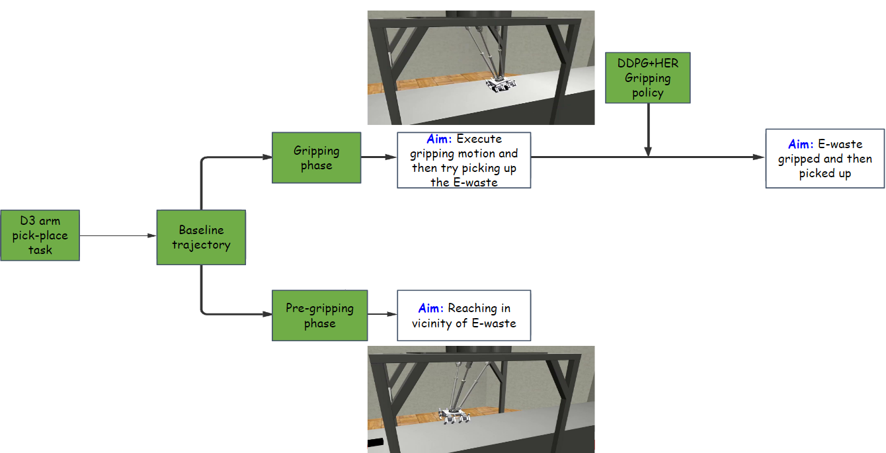

## 🤖 Wombat_robosuite
<div style="width: 100%; text-align: center; margin:auto;">
      
</div>

Simulation framework for learning an object-agnostic control policy for pick-and-place operation on a novel 6-DoF parallel manipulator (aka D3 arm) using Deep reinforcement learning, specifically DDPG (Deep Deterministic Policy Gradient) + HER (Hindshight Experience Replay) algorithm.

## 🛠️ Installation
- Install MuJoCo
1. Download the MuJoCo version 2.1 binaries for <a href="https://mujoco.org/download/mujoco210-linux-x86_64.tar.gz">Linux</a>.
2. Extract the downloaded mujoco210 directory into ~/.mujoco/mujoco210.
3. Clone this repository
```
cd ~
git clone -b main https://github.com/biorobotics/Wombat_robosuite.git
```
4. Install the dependencies
```
cd Wombat_robosuite/robosuite
pip3 install -r requirements.txt
```
5. Test your installation with
```
python demos/demo_random_action.py
```

## 🔄 Pipeline
<div style="width: 100%; text-align: center; margin:auto;">
      
</div>


## 🏋️ Training (DDPG+HER)
```
cd ~/Wombat_robosuite/robosuite/HER+DDPG/hindsight-experience-replay-latest
python D3_train_dyn_rand.py
```
Weights will be stored in 'saved_models/PickPlaceiPhone'. Currently, the best trained weights are with the name 'Model_dyn_rand_epoch_50.pt'.

## 🎮 Demo (Testing)
```
cd ~/Wombat_robosuite/robosuite/HER+DDPG/hindsight-experience-replay-latest
python D3_demo_dyn_rand.py
```

## 📊 Results
<div style="width: 100%; text-align: center; margin:auto;">
      
</div>
<div style="width: 100%; text-align: center; margin:auto;">
      
</div>

## 🙏 Credits

This project builds upon the excellent work done in the [Robosuite Framework](https://robosuite.ai/). Many thanks to all the contributors involved.


